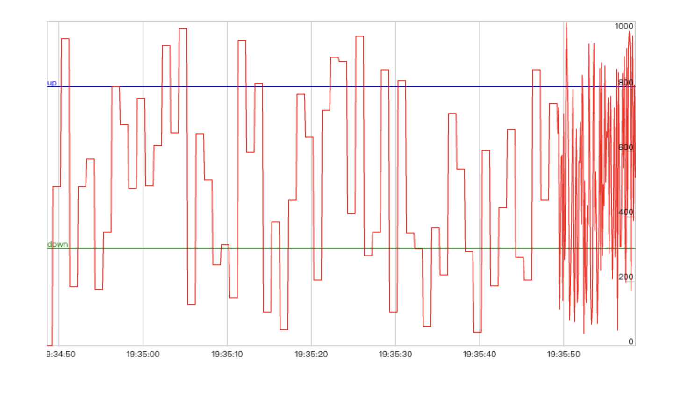

# WebRTC-Tools

English | [简体中文](./README-zh_CN.md)

## Install

Use `npm`

```
# with npm
npm i webrtc-tools
```

CDN is also provided

```
<script src="https://ltsg123.github.io/webrtc-tools/dist/index.js"></script>
```

Example image:


## build

yarn

yarn build

## dev

yarn

yarn dev

**Any questions you can contact me at ltsg0317@outlook.com**
