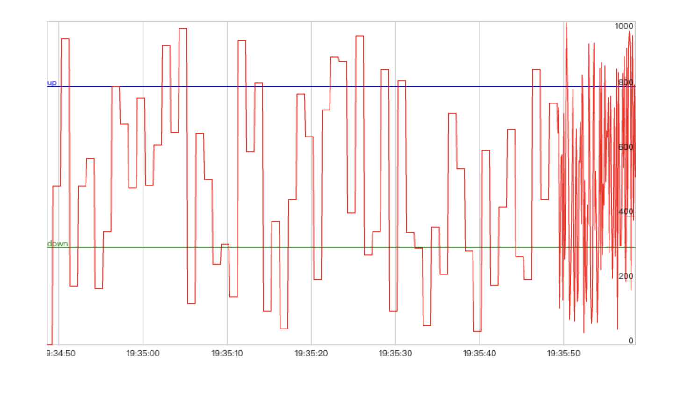

# WebRTC-Tools

[English](./README.md) | 简体中文

demo: https://ltsg123.github.io/webrtc-tools/example/

## Install

Use `npm`

```
# with npm
npm i webrtc-tools
```

CDN is also provided

```
<script src="https://ltsg123.github.io/webrtc-tools/dist/index.js"></script>
```

示例图片：


## build

yarn

yarn build

## dev

yarn

yarn dev

**Any questions you can contact me at ltsg0317@outlook.com**
